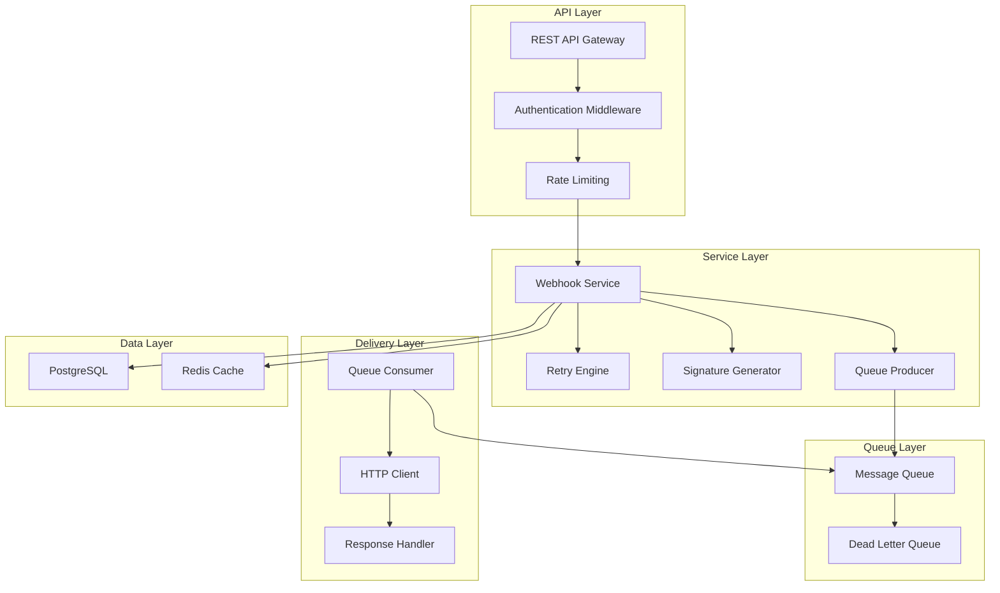

# Phase 2: Core Implementation

**Phase ID:** PH-002  
**Duration:** 4 weeks  
**Start Date:** 2025-02-17  
**End Date:** 2025-03-17  

## Overview

Phase 2 focuses on building the core functionality of the Webhook Delivery Microservice. This includes implementing the webhook service, retry logic, authentication mechanisms, API endpoints, and integrating with the message queue infrastructure established in Phase 1. The team will follow an agile approach with 2-week sprints, delivering incrementally testable components.

## Objectives

1. Develop a robust webhook delivery service with queuing capabilities
2. Implement configurable retry mechanisms with exponential backoff
3. Build secure authentication using HMAC-based signatures
4. Create comprehensive REST APIs for webhook management
5. Ensure high performance and scalability requirements are met

## Success Criteria

- All core components implemented and unit tested with >90% coverage
- Service can handle 10,000 concurrent webhook deliveries
- Retry logic successfully delivers 95% of failed webhooks within 24 hours
- HMAC authentication implemented and validated
- API contract completed and documented

## Technical Architecture



## Detailed Tasks

### Task 2.1: Build Webhook Service Core
- Initialize project structure and dependencies
- Implement webhook entity models and database schemas
- Create service interfaces and core logic
- Implement HTTP client with timeout and connection pooling
- Add request/response logging and correlation IDs
- Create health check endpoints

### Task 2.2: Implement Retry Logic
- Design configurable retry policy framework
- Implement exponential backoff algorithm
- Create retry state machine implementation
- Develop dead letter queue handling
- Add circuit breaker functionality
- Implement batch retry capabilities

### Task 2.3: Add Authentication
- Implement HMAC signature generation algorithm
- Create key management system
- Implement signature verification endpoint
- Add support for multiple hash algorithms
- Implement key rotation mechanism
- Security hardening and testing

### Task 2.4: Create API Endpoints
- Design RESTful API contract
- Implement webhook submission endpoint
- Create webhook configuration management APIs
- Add status and metrics endpoints
- Implement pagination and filtering
- Create OpenAPI documentation

### Task 2.5: Queue Integration
- Implement message producer/consumer patterns
- Configure queue topology and routing
- Add message persistence guarantees
- Implement consumer acknowledgment
- Add dead letter handling
- Performance tuning and optimization

## Implementation Details

### Webhook Service Implementation

#### Core Components
```go
// Main service interface
type WebhookService interface {
    Deliver(ctx context.Context, webhook *Webhook) error
    GetStatus(ctx context.Context, id string) (*DeliveryStatus, error)
    ConfigureEndpoint(ctx context.Context, config *EndpointConfig) error
}

// Retry policy configuration
type RetryPolicy struct {
    MaxAttempts    int
    BaseDelay      time.Duration
    MaxDelay       time.Duration
    BackoffFactor  float64
}

// Delivery state tracking
type DeliveryStatus struct {
    ID          string
    Status      DeliveryState
    Attempts    int
    LastAttempt time.Time
    NextAttempt time.Time
    Error       string
}
```

#### Performance Optimizations
- Connection pooling for HTTP clients
- Batching for queue operations
- Asynchronous processing patterns
- Efficient serialization (protobuf/msgpack)
- Memory pooling for high-frequency allocations

### Authentication Implementation

#### HMAC Signature Generation
```go
func GenerateHMAC(payload []byte, secret []byte, algorithm string) ([]byte, error) {
    var h func() hash.Hash
    
    switch algorithm {
    case "sha256":
        h = hmac.New(sha256.New, secret)
    case "sha512":
        h = hmac.New(sha512.New, secret)
    default:
        return nil, errors.New("unsupported algorithm")
    }
    
    h.Write(payload)
    return h.Sum(nil), nil
}
```

#### Security Headers
```http
X-Webhook-Signature: sha256=<signature>
X-Webhook-Timestamp: <unix-timestamp>
X-Webhook-ID: <unique-id>
```

## API Specification

### Submit Webhook
```
POST /api/v1/webhooks/deliver
Content-Type: application/json
Authorization: Bearer <token>

{
  "url": "https://customer.example.com/webhook",
  "payload": {...},
  "headers": {
    "Authorization": "Bearer app-secret"
  },
  "retryPolicy": {
    "maxAttempts": 3
  }
}
```

### Get Delivery Status
```
GET /api/v1/webhooks/{id}/status
Response:
{
  "id": "webhook-123",
  "status": "delivered",
  "attempts": 1,
  "deliveredAt": "2025-02-03T15:30:00Z"
}
```

## Testing Strategy

### Unit Tests
- >90% code coverage requirement
- Test all retry scenarios
- Mock external dependencies
- Test edge cases and error conditions
- Performance-critical path testing

### Integration Tests
- End-to-end webhook delivery flow
- Queue integration validation
- Database transaction testing
- Authentication flow testing
- Performance benchmarking

### Contract Tests
- API contract validation
- Message format verification
- Backward compatibility testing

## Performance Targets

| Metric | Target | Measurement |
|--------|--------|-------------|
| Queue latency | < 10ms | p99 |
| Delivery request processing | < 50ms | p95 |
| Concurrent deliveries | 10,000 | sustained |
| Memory usage | < 500MB | per instance |
| CPU usage | < 70% | average |

## Monitoring Integration

### Custom Metrics
- Webhook backlog depth
- Delivery success/failure rates
- Retry attempt counts
- Endpoint health scores
- Processing throughput

### Distributed Tracing
- Request correlation IDs
- Span annotations for retries
- Performance bottleneck identification

## Risk Mitigation

| Risk | Mitigation Strategy | Contingency |
|------|-------------------|-------------|
| Performance bottlenecks | Profile early, optimize hot paths | Scale horizontally |
| Authentication bugs | Security review, fuzz testing | Use external service |
| Queue message loss | Persistent queues, monitoring | Implement idempotency |
| Memory leaks | Regular profiling, testing | Auto-restart policies |

## Dependencies

### Internal Dependencies
- Authentication Service for API access
- Configuration Service for policies
- Monitoring Infrastructure for metrics

### External Dependencies
- Customer endpoint availability
- Certificate authority
- Time synchronization

## Deliverables

1. **Source Code Repository**
   - Complete implementation with tests
   - Documentation and examples
   - CI/CD configuration

2. **API Documentation**
   - OpenAPI specification
   - Client SDK examples
   - Integration guides

3. **Performance Test Reports**
   - Benchmark results
   - Scalability analysis
   - Optimization recommendations

4. **Security Review Package**
   - Threat model documentation
   - Penetration test results
   - Security scan reports

---

## Review Checklist

- [ ] All core services implemented
- [ ] Unit tests achieving coverage targets
- [ ] Integration tests passing
- [ ] API documentation complete
- [ ] Performance benchmarks met
- [ ] Security review passed
- [ ] Code review completed
- [ ] Logging and monitoring integrated

## Next Steps

Upon successful completion of Phase 2:
1. Begin comprehensive testing in Phase 3
2. Prepare deployment playbooks
3. Create customer migration guide
4. Schedule production deployment

---

*Phase Owner: Backend Engineering Lead*  
* Technical Reviewer: Sr. Software Engineer*  
* Business Approver: Product Manager*