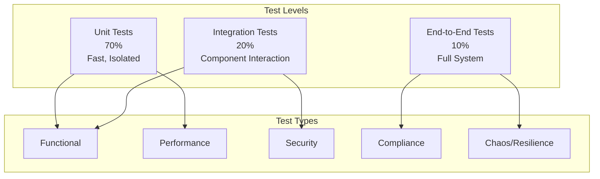
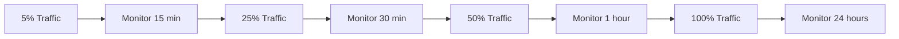

# Phase 3: Testing & Deployment

**Phase ID:** PH-003  
**Duration:** 3 weeks  
**Start Date:** 2025-03-17  
**End Date:** 2025-04-04  

## Overview

Phase 3 is dedicated to comprehensive testing, validation, and production deployment of the Webhook Delivery Microservice. This phase ensures the service meets all functional and non-functional requirements, performs reliably under production load, and can be deployed safely without disrupting existing operations. Testing will be systematic and thorough, covering unit, integration, performance, security, and end-to-end scenarios.

## Objectives

1. Validate all functionality through comprehensive testing
2. Ensure performance meets or exceeds requirements under realistic load
3. Verify security controls and compliance with standards
4. Execute a safe, gradual production deployment with rollback capability
5. Complete all documentation and training materials

## Success Criteria

- All test suites pass with 100% success rate
- Performance benchmarks exceed target metrics
- Security audit passes with zero critical findings
- Production deployment completes with zero downtime
- All stakeholders sign off on production readiness

## Testing Strategy

### Test Pyramid



## Detailed Tasks

### Task 3.1: Unit & Integration Testing
- Review and enhance unit test coverage
- Implement integration test scenarios
- Test message queue integration thoroughly
- Validate database interactions under load
- Test error handling and edge cases
- Create automated test execution pipeline

### Task 3.2: Performance Testing
- Design realistic load test scenarios
- Baseline performance measurement
- Stress testing to find breaking point
- Capacity testing and scaling validation
- Latency measurement and optimization
- Resource utilization analysis

### Task 3.3: Security Testing
- Static code analysis (SAST)
- Dynamic security testing (DAST)
- Penetration testing
- Authentication bypass attempts
- Input validation testing
- Rate limiting verification

### Task 3.4: Deployment Preparation
- Create deployment playbooks
- Configure canary deployment strategy
- Set up monitoring alerts
- Prepare rollback procedures
- Document incident response plans
- Conduct dry runs

### Task 3.5: Production Deployment
- Deploy to canary instances
- Monitor metrics and health checks
- Gradual traffic increase
- Full production deployment
- Post-deployment validation
- Knowledge transfer to operations

## Test Execution Plan

### Unit Testing Details

#### Coverage Requirements
- Service layer: 95%
- Repository layer: 90%
- API controllers: 100%
- Utility functions: 100%
- Overall minimum: 90%

#### Test Categories
```bash
# Run all unit tests
make test-unit

# Run with coverage
make test-coverage

# Test specific components
make test-retries
make test-authentication
make test-queue-integration
```

### Integration Testing Scenarios

#### Happy Path Tests
1. Webhook submission → Queue → Delivery → Success
2. Batch webhook submission → Parallel processing
3. Configuration update → Immediate application
4. Retry attempt → Backoff → Success

#### Failure Path Tests
1. Endpoint unavailable → Retry → DLQ
2. Invalid authentication → Rejection
3. Queue overflow → Backpressure handling
4. Database failure → Recovery

#### Edge Cases
1. Empty payload handling
2. Maximum payload size
3. Concurrent configuration changes
4. Service restart during active deliveries

### Performance Testing Plan

#### Load Test Scenarios
| Scenario | RPS | Duration | Success Rate |
|----------|-----|----------|--------------|
| Normal Load | 1,000 | 30 min | 99.9% |
| Peak Load | 5,000 | 10 min | 99.5% |
| Stress Test | 10,000 | 5 min | 95% |
| Spike Test | 20,000 burst | 1 min | 90% |

#### Performance Metrics Collection
```bash
# K6 performance test script
import http from 'k6/http';
import { check, sleep } from 'k6';

export let options = {
  stages: [
    { duration: '2m', target: 1000 },
    { duration: '5m', target: 1000 },
    { duration: '2m', target: 5000 },
    { duration: '5m', target: 5000 },
    { duration: '2m', target: 0 },
  ],
};

export default function() {
  let payload = JSON.stringify({
    url: 'https://test.example.com/webhook',
    payload: { test: 'data' },
  });
  
  let params = {
    headers: {
      'Content-Type': 'application/json',
      'Authorization': 'Bearer test-token',
    },
  };
  
  let res = http.post('http://api.hostname/webhooks/deliver', payload, params);
  check(res, {
    'status is 200': (r) => r.status === 200,
    'response time < 50ms': (r) => r.timings.duration < 50,
  });
  sleep(1);
}
```

### Security Testing Plan

#### Security Checklist
- [ ] SQL injection prevention
- [ ] XSS protection
- [ ] Authentication bypass attempts
- [ ] Rate limiting effectiveness
- [ ] Input validation
- [ ] Secret handling
- [ ] TLS configuration
- [ ] Headers security

#### Test Commands
```bash
# OWASP ZAP Baseline Scan
docker run -t owasp/zap2docker-stable zap-baseline.py \
  -t http://api.example.com \
  -J report.json

# Gosec Static Analysis
gosec ./...

# Burp Suite Manual Testing
# Documented separately
```

## Deployment Strategy

### Canary Deployment Plan



### Deployment Timeline

| Date | Activity | Success Criteria |
|------|----------|------------------|
| 2025-03-24 | Canary (5%) | No error spikes, latency < 100ms |
| 2025-03-25 | Canary (25%) | Success rate > 99.8% |
| 2025-03-26 | Canary (50%) | CPU < 70%, Memory < 80% |
| 2025-03-27 | Full Deployment | All metrics green |

### monitoring During Deployment

#### Critical Metrics to Watch
- Error rate (must stay < 0.5%)
- P95 latency (must stay < 200ms)
- Queue depth (must not increase)
- Database connections (must stay < 80%)
- Memory usage (must stay < 85%)

#### Alert Thresholds
```yaml
alerts:
  errorRate:
    warning: 0.5%
    critical: 1.0%
  latency:
    warning: 200ms (p95)
    critical: 500ms (p95)
  queueDepth:
    warning: 1000 messages
    critical: 5000 messages
```

### Rollback Triggers

Automatic rollback if:
1. Error rate > 2% for 5 minutes
2. P99 latency > 1 second for 3 minutes
3. Health checks fail > 3 times
4. Queue depth increases > 10x baseline

Manual rollback if:
1. Customer reports > 5 issues
2. Unexpected behavior observed
3. Security concerns raised

## Test Data Management

### Test Data Strategy
- Use synthetic data for performance tests
- Anonymized production data for realistic scenarios
- Test data cleanup procedures
- PII protection compliance

### Data Categories
- Real customer endpoints (anonymized)
- Various payload sizes and formats
- Authentication tokens (invalid/expired)
- Rate limit scenarios

## Deliverables

1. **Test Execution Report**
   - All test results and metrics
   - Performance benchmarks
   - Security assessment findings
   - Identified issues and resolutions

2. **Deployment Documentation**
   - Step-by-step deployment guide
   - Runbook for operations
   - Monitoring configuration
   - Troubleshooting guide

3. **Release Package**
   - Container images with version tags
   - Configuration templates
   - Database migration scripts
   - Artifact checksums

4. **Training Materials**
   - Operations team training deck
   - Support team FAQ
   - Customer migration guide

---

## Sign-off Requirements

### Technical Sign-off
- All tests passing with required coverage
- Performance benchmarks met
- Security audit approved
- Infrastructure validated

### Business Sign-off
- Customer impact assessment reviewed
- Risk mitigation approved
- Rollback plan accepted
- Support readiness verified

---

## Review Checklist

- [ ] Unit test coverage ≥ 90%
- [ ] All integration tests passing
- [ ] Performance targets achieved
- [ ] Security scan cleared
- [ ] Monitoring deployed and tested
- [ ] Documentation complete
- [ ] Team trained
- [ ] Rollback tested
- [ ] Backup procedures verified
- [ ] Compliance reviewed

## Post-Deployment Activities

1. **Monitoring** (72 hours)
   - Increased alert sensitivity
   - 24/7 on-call availability
   - Hourly metric reviews

2. **Validation** (1 week)
   - Customer feedback collection
   - Performance validation
   - End-to-end testing with real customers

3. **Optimization** (2 weeks)
   - Performance tuning based on real load
   - Alert threshold adjustments
   - Process improvements

---

*Phase Owner: QA Engineering Lead*  
* Deployment Lead: DevOps Engineer*  
* Business Approver: Engineering Director*