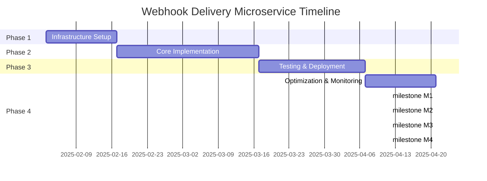

# PRD: Webhook Delivery Microservice

**Document ID:** PRD-001  
**Version:** 1.0  
**Created:** 2025-02-03  
**Last Updated:** 2025-02-03  
**Status:** Draft

## 1. Executive Summary

The Webhook Delivery Microservice is a resilient, scalable service designed to reliably deliver webhooks from our platform to external endpoints. This service addresses critical failures in our current webhook delivery system, including lost notifications, lack of retry mechanisms, and no visibility into delivery status. The microservice will ensure at-least-once delivery semantics, provide comprehensive monitoring and alerting, and support exponential backoff retry strategies. By implementing this service, we will improve system reliability, enhance customer satisfaction, and reduce manual intervention costs associated with webhook delivery issues.

## 2. Problem Statement

Our current webhook delivery mechanism suffers from several critical issues:
- **No Retry Logic**: Failed webhook deliveries are immediately discarded, causing data loss
- **No Monitoring**: Lack of visibility into delivery success/failure rates makes it impossible to diagnose issues
- **No Authentication**: Webhooks are sent without proper authentication, making them vulnerable to interception
- **Single Point of Failure**: Current implementation is tightly coupled with the main application
- **Poor Performance**: Synchronous webhook delivery blocks critical business workflows
- **No Dead Letter Queue**: Failed deliveries cannot be recovered or manually retried

These issues have resulted in customer complaints, lost business events, and increased operational overhead. There is an urgent need for a dedicated, resilient webhook delivery system.

## 3. Success Criteria

### Primary Success Metrics
- **99.9%** webhook delivery success rate for healthy endpoints
- **< 100ms** average latency for webhook queuing
- **95%** of failed webhooks successfully delivered within 24 hours via retry
- **100%** of webhook deliveries logged with timestamps and status

### Secondary Success Metrics
- Zero data loss during system migrations
- Automated alerts configured for delivery failure rate > 5%
- Support for at least 10,000 concurrent webhook deliveries
- Customer support tickets related to webhook failures reduced by 80%

### Acceptance Criteria
- All existing webhook integrations continue to work without modification
- New HMAC-based authentication is implemented for all webhooks
- Retry policy is configurable (default: 3 attempts with exponential backoff)
- Dashboard shows real-time delivery metrics and failure reasons
- Dead letter queue allows manual retry of failed webhooks
- Service maintains 99.95% uptime

## 4. Stakeholders

### Primary Stakeholders
| Role | Name | Responsibilities |
|------|------|------------------|
| Product Manager | TBD | Define requirements, prioritize features, manage roadmap |
| Engineering Lead | TBD | Technical design, architecture decisions, code reviews |
| DevOps Engineer | TBD | Infrastructure, monitoring, deployment strategy |

### Secondary Stakeholders
| Role | Team | Involvement |
|------|------|-------------|
| Customer Support | Support Team | Handle webhook-related issues, provide feedback |
| Security | Security Team | Review authentication mechanisms, audit webhook security |
| Product Teams | Various | Consume webhook deliveries, provide integration requirements |

### External Stakeholders
- **Customers**: Rely on webhook notifications for their business processes
- **Partners**: Need reliable integration points for their systems

## 5. Scope

### In Scope
#### Features
- Asynchronous webhook delivery with message queue
- Configurable retry policy with exponential backoff
- HMAC-based authentication for webhook security
- Comprehensive logging and monitoring
- Dead letter queue for failed deliveries
- RESTful API for webhook management
- Real-time delivery status dashboard
- Rate limiting per endpoint
- Dynamic endpoint configuration

#### Integrations
- Integration with existing AuthN service
- Monitoring infrastructure (Prometheus, Grafana)
- Alerting system (PagerDuty)
- Existing message bus infrastructure
- Centralized logging system

### Out of Scope
- Webhook payload transformation
- Subscription management UI
- Event aggregation
- Webhook analytics beyond delivery metrics
- SDKs for webhook consumers
- Batch webhook delivery

## 6. Dependencies

### Internal Dependencies
- Message Queue Service (RabbitMQ/Apache Kafka)
- Authentication Service (for HMAC key management)
- Configuration Management Service
- Monitoring Infrastructure (Prometheus, Grafana)
- Centralized Logging (ELK Stack)
- Container Orchestration Platform (Kubernetes)

### External Dependencies
- Cloud Provider (AWS/GCP/Azure)
- CDN for static assets (if any)
- External monitoring services (if used)

### Technical Dependencies
- Programming language and framework (Go/Node.js/Python)
- Database for webhook metadata (PostgreSQL)
- Redis for caching
- Load balancer configuration
- SSL certificates

## 7. Phases

### Phase 1: Infrastructure Setup (2 weeks)
- Provision required infrastructure
- Set up monitoring and logging
- Create CI/CD pipelines
- Establish development environment

### Phase 2: Core Implementation (4 weeks)
- Build webhook service core
- Implement retry logic
- Add authentication mechanisms
- Create API endpoints
- Integrate with message queue

### Phase 3: Testing & Deployment (3 weeks)
- Unit and integration testing
- Performance testing
- Security testing
- Gradual rollout
- Documentation

### Phase 4: Optimization & Monitoring (2 weeks)
- Performance tuning
- Advanced monitoring setup
- Create dashboards
- Team training

## 8. Technical Requirements

### Functional Requirements

#### Webhook Delivery
- FR-001: Accept webhook delivery requests via REST API
- FR-002: Queue webhooks for asynchronous delivery
- FR-003: Deliver webhooks to configured endpoints
- FR-004: Support HTTP/HTTPS protocols
- FR-005: Support custom headers in webhook deliveries

#### Retry Logic
- FR-006: Implement configurable retry policies
- FR-007: Support exponential backoff algorithms
- FR-008: Track retry attempts and outcomes
- FR-009: Move to dead letter queue after final attempt

#### Authentication
- FR-010: Generate HMAC signatures for all webhooks
- FR-011: Support multiple signature algorithms (SHA-256, SHA-512)
- FR-012: Provide signature verification endpoints
- FR-013: Rotate signing keys securely

#### Monitoring
- FR-014: Log all delivery attempts
- FR-015: Export metrics to monitoring system
- FR-016: Provide health check endpoints
- FR-017: Track delivery success/failure rates

### Non-Functional Requirements

#### Performance
- NFR-001: Handle 10,000 concurrent deliveries
- NFR-002: Process webhook delivery requests in < 50ms
- NFR-003: Support burst capacity of 50,000 webhooks/minute
- NFR-004: Maintain < 100ms p99 latency for queue operations

#### Reliability
- NFR-005: 99.95% service uptime
- NFR-006: Zero data loss during restarts/failures
- NFR-007: Graceful degradation under load
- NFR-008: Automatic recovery from infrastructure failures

#### Scalability
- NFR-009: Horizontal scaling capability
- NFR-010: Auto-scaling based on queue depth
- NFR-011: Support for multiple regions
- NFR-012: Database sharding support for > 100M webhooks/day

#### Security
- NFR-013: All communication encrypted in transit
- NFR-014: Authentication for all API endpoints
- NFR-015: Audit trail for all configuration changes
- NFR-016: Rate limiting to prevent abuse

## 9. Risks

### Technical Risks
| Risk | Probability | Impact | Mitigation Strategy |
|------|-------------|--------|---------------------|
| Message queue becomes bottleneck | Medium | High | Implement queue monitoring, partitioning strategy |
| Performance under high load | Medium | High | Load testing, auto-scaling, circuit breakers |
| Authentication implementation bugs | Low | High | Security review, extensive testing |
| Database performance issues | Low | Medium | Proper indexing, connection pooling, caching |

### Business Risks
| Risk | Probability | Impact | Mitigation Strategy |
|------|-------------|--------|---------------------|
| Customer migration delays | Medium | Medium | Detailed migration plan, backward compatibility |
| Increased operational costs | Low | Low | Cost monitoring, optimization |
| SLA breaches during rollout | Low | High | Gradual rollout, rollback procedures |

### Operational Risks
| Risk | Probability | Impact | Mitigation Strategy |
|------|-------------|--------|---------------------|
| Team skill gaps | Low | Medium | Training, documentation, expert consultation |
| Vendor dependency issues | Low | Medium | Multi-cloud strategy, open-source alternatives |

## 10. Timeline

### Key Milestones
- **M1** (2025-02-14): Infrastructure and development environment ready
- **M2** (2025-03-17): Core webhook service implemented and tested
- **M3** (2025-04-04): Production deployment completed
- **M4** (2025-04-18): Project fully delivered with documentation

### Critical Path
1. Infrastructure provisioning must complete before core implementation
2. Authentication service integration required for retry implementation
3. Performance testing must pass before production deployment

## 11. Resources

### Team Composition
| Role | FTE | Duration | Responsibilities |
|------|-----|----------|------------------|
| Engineering Lead | 1.0 | 11 weeks | Architecture, code reviews |
| Backend Developer | 2.0 | 8 weeks | Service implementation |
| DevOps Engineer | 1.0 | 6 weeks | Infrastructure, deployment |
| QA Engineer | 1.0 | 5 weeks | Testing, validation |
| Product Manager | 0.5 | 11 weeks | Requirements, coordination |

### Infrastructure Resources
| Resource | Specification | Duration | Cost Estimate |
|----------|---------------|----------|---------------|
| Kubernetes Cluster | 3 nodes, 8 vCPU each | 11 weeks | $5,000 |
| Database | PostgreSQL, RDS Medium | 11 weeks | $2,000 |
| Message Queue | RabbitMQ, 3 nodes | 11 weeks | $3,000 |
| Monitoring | Prometheus + Grafana | 11 weeks | $1,000 |
| Total Infrastructure Cost | | | $11,000 |

### Software/Licenses
- Open-source software stack (no licensing costs)
- Cloud provider credits requested: $15,000

## 12. Approval Process

### Review Gates
1. **Requirements Review** (2025-02-05)
   - Stakeholders: Product Lead, Engineering Lead, Security Team
   - Criteria: All requirements clearly defined, risks identified

2. **Architecture Review** (2025-02-10)
   - Stakeholders: Engineering Lead, DevOps, Architecture Board
   - Criteria: Technical design meets NFRs, scalability proven

3. **Security Review** (2025-03-05)
   - Stakeholders: Security Team, Engineering Lead
   - Criteria: Authentication secure, audit trail complete

4. **Go-Live Review** (2025-04-02)
   - Stakeholders: All stakeholders, CTO
   - Criteria: All tests passed, infrastructure ready, migration plan approved

### Approval Matrix
| Decision | Approver | Required Sign-off |
|----------|----------|-------------------|
| Requirements | Product Manager | ✓ |
| Architecture | Engineering Lead | ✓ |
| Security | CISO | ✓ |
| Budget | CTO | ✓ |
| Go-Live | CTO, Product Lead | ✓ ✓ |

### Documentation Requirements
- All review decisions documented in Confluence
- Architecture diagrams updated and versioned
- Test results attached to go-live approval
- Post-mortem process defined for any production issues

---

## Document History

| Version | Date | Author | Changes |
|---------|------|--------|---------|
| 1.0 | 2025-02-03 | Product Team | Initial draft created |
| | | | |
| | | | |

## Appendices

### A. Glossary
- **HMAC**: Hash-based Message Authentication Code
- **DLQ**: Dead Letter Queue
- **SLA**: Service Level Agreement
- **NFR**: Non-Functional Requirement

### B. References
- [Webhook Standards RFC]()
- [Company Architecture Standards]()
- [Security Policy - Authentication]()

### C. Supporting Documents
- Technical Design Document (TBD)
- API Specification (TBD)
- Migration Plan (TBD)
- Monitoring Strategy (TBD)